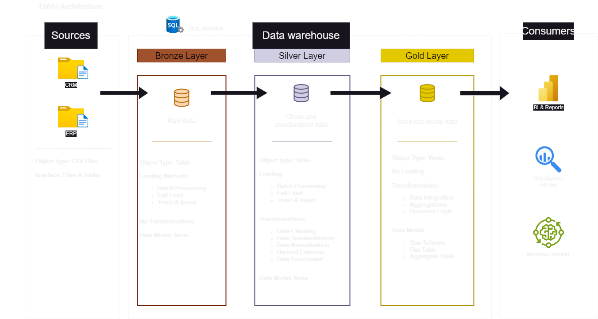
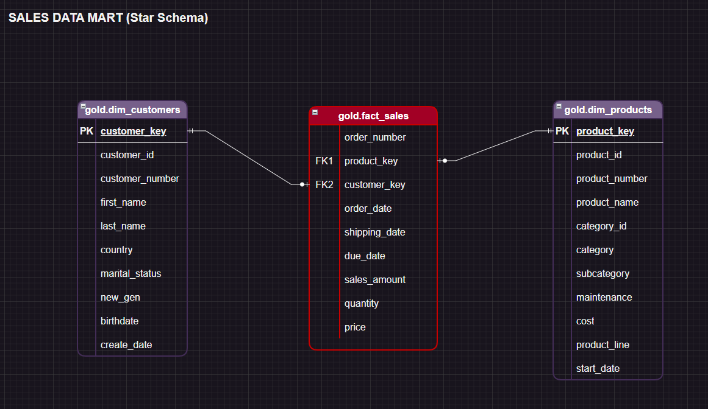

# SQL Data Warehouse Project

A data warehouse built in **SQL Server (T-SQL)** following the **Medallion
Architecture (Bronze → Silver → Gold)**. It integrates data from two source
systems (CRM and ERP) into a dimensional star schema, ready for analytical
queries and BI reporting.

Portfolio project built as part of my path into **Data Engineering**,
applying ETL, dimensional modeling, and data quality engineering on top of
SQL Server. The repository is fully self-contained and reproducible end to
end — clone it, run six scripts in order, and query a working star schema.

---

## Architecture



The project follows the **Medallion Architecture** pattern, with three
layers that progressively refine the data:

| Layer | Purpose | Object type | Transformations |
|---|---|---|---|
| **Bronze** | Raw data, exactly as it arrives from the sources (CRM/ERP) | Tables | None (raw load via `BULK INSERT`) |
| **Silver** | Cleaned and standardized data | Tables | Cleansing, standardization, normalization, derived columns |
| **Gold** | Business-ready data, modeled as a star schema | Views | Integration, aggregations, business logic |

**End-to-end flow:** Sources (CSV) → Bronze → Silver → Gold → SQL Queries / BI

More diagrams available in [`docs/`](docs/):
- [`data_flow.png`](docs/data_flow.png) — data flow between tables across layers
- [`data_integration.png`](docs/data_integration.png) — how CRM and ERP are integrated
- [`star_schema.png`](docs/star_schema.png) — dimensional model of the Gold layer

---

## What this warehouse answers

The Gold layer is modeled so that a single, simple `JOIN` between
`fact_sales` and its two dimensions can answer real business questions
without touching the underlying source systems, for example:

- Which product categories generate the most revenue, and how has that
  shifted over time?
- Who are the highest-value customers, and which countries do they come
  from?
- How does average order value differ by customer segment (country,
  marital status)?
- Which products have been discontinued or replaced, and when?

That last one is only possible because Silver preserves full product
version history (see **Technical highlights** below) — a detail most
tutorial-level warehouses skip entirely.

---

## Repository structure

```
sql-data-waherouse-project/
│
├── datasets/                  # Source data (synthetic, included — see note below)
│   ├── source_crm/
│   │   ├── cust_info.csv
│   │   ├── prd_info.csv
│   │   └── sales_details.csv
│   └── source_erp/
│       ├── CUST_AZ12.csv
│       ├── LOC_A101.csv
│       └── PX_CAT_G1V2.csv
│
├── scripts/                   # All SQL code for the pipeline
│   ├── init_database.sql      # Creates the DataWarehouse database and schemas
│   ├── bronze/
│   │   ├── ddl_bronze.sql     # Bronze table definitions
│   │   └── proc_load_bronze.sql   # Bronze load (BULK INSERT + logging)
│   ├── silver/
│   │   ├── ddl_silver.sql     # Silver table definitions
│   │   └── proc_load_silver.sql   # ETL Bronze → Silver (cleansing/transformation)
│   └── gold/
│       └── ddl_gold.sql       # Gold views (star schema: dims + fact)
│
├── tests/                     # Data quality checks
│   ├── quality_checks_silver.sql
│   └── quality_checks_gold.sql
│
├── docs/                      # Documentation and diagrams
│   ├── data_catalog.md        # Data dictionary for the Gold layer
│   ├── naming_conventions.md  # Naming conventions used throughout the project
│   ├── data_architecture.drawio / .png
│   ├── data_flow.drawio / .png
│   ├── data_integration.drawio / .png
│   └── star_schema.drawio / .png
│
├── LICENSE
└── README.md
```

---

## How to run this project

> Requires SQL Server (SSMS or Azure Data Studio). No other setup needed —
> the sample dataset is included in the repo, so the pipeline runs
> immediately after cloning.

1. **Create the database and schemas**
   ```sql
   -- scripts/init_database.sql
   ```
   Creates the `DataWarehouse` database and the three schemas: `bronze`,
   `silver`, `gold`.

2. **Create the tables and load the Bronze layer**
   ```sql
   -- scripts/bronze/ddl_bronze.sql
   -- scripts/bronze/proc_load_bronze.sql
   EXEC bronze.load_bronze;
   ```
   > `proc_load_bronze.sql` uses `BULK INSERT` with hardcoded file paths.
   > Update the paths in that script to point to this repo's local
   > `datasets/source_crm/` and `datasets/source_erp/` folders on your
   > machine before running it.

3. **Create the tables and load the Silver layer**
   ```sql
   -- scripts/silver/ddl_silver.sql
   -- scripts/silver/proc_load_silver.sql
   EXEC silver.load_silver;
   ```

4. **Create the Gold layer views**
   ```sql
   -- scripts/gold/ddl_gold.sql
   ```

5. **Validate data quality**
   ```sql
   -- tests/quality_checks_silver.sql
   -- tests/quality_checks_gold.sql
   ```
   Most checks should return **0 rows**. A handful of rows are expected in
   a few checks by design (see note below) — every other check passing
   clean confirms the pipeline is working correctly.

6. **Query the Gold layer**
   ```sql
   SELECT * FROM gold.dim_customers;
   SELECT * FROM gold.dim_products;
   SELECT * FROM gold.fact_sales;
   ```

### About the dataset

The original CSV files used in the course this project is based on are not
included here, since they're the instructor's course material. Instead,
this repository ships with a **synthetic dataset I generated myself**
(`datasets/source_crm/`, `datasets/source_erp/`) that mirrors the exact
column structure of the original — same tables, same data types, same
naming — but every value (names, dates, IDs, prices) is fictional.

The synthetic data was deliberately built to reproduce the same data
quality problems the Silver layer is designed to fix, so the pipeline
demonstrates real, non-trivial behavior end to end rather than passing
through already-clean data:

| Issue | Where | What Silver does with it |
|---|---|---|
| Dates stored as invalid `INT` (`0`, wrong digit count) | `sales_details.csv` | Converted to `NULL` instead of failing the cast |
| Negative or missing prices | `sales_details.csv` | Recalculated from `sales / quantity` |
| Inconsistent `sales` vs. `quantity × price` | `sales_details.csv` | Recalculated to restore consistency |
| Duplicate customer records (different load dates) | `cust_info.csv` | De-duplicated, keeping the most recent record |
| Multiple versions of the same product | `prd_info.csv` | Full version history kept in Silver; only the current version surfaced in Gold |
| Inconsistent codes (`'S'`/`'Single'`, `'DE'`/`'Germany'`) | multiple files | Standardized to consistent business-friendly values |
| `NAS`-prefixed and dash-formatted customer IDs | ERP files | Stripped/normalized to match the CRM business key |

Because of this, a few rows in `tests/quality_checks_silver.sql` are
*expected* to surface residual edge cases (e.g. customers with no matching
country) — that reflects a partial, realistic integration between two
systems, not a bug in the dataset.

---

## Data model (Gold Layer)

The Gold layer exposes a simple **star schema**: two dimensions and one
fact table.



- **`gold.dim_customers`** — customer dimension (CRM + ERP combined)
- **`gold.dim_products`** — product dimension (active versions only)
- **`gold.fact_sales`** — sales facts, one record per product line sold

Full column-by-column data dictionary: [`docs/data_catalog.md`](docs/data_catalog.md)

Naming conventions used throughout the project: [`docs/naming_conventions.md`](docs/naming_conventions.md)

---

## Technical highlights

- **Strict layer separation**, each with its own schema and single responsibility
- **Stored procedures with logging and error handling** (`TRY/CATCH`, per-table duration `PRINT`) in the Bronze and Silver loads
- **Data reconciliation in Silver**: cleansing of dates stored as `INT`, recalculating price/sales when the source data is inconsistent, respecting the dependency order between calculated columns
- **Slowly Changing Dimension** for products: `silver.crm_prd_info` keeps the full version history of each product (`prd_start_dt`/`prd_end_dt` computed with `LEAD`), and `gold.dim_products` filters down to the current version only
- **Surrogate keys** generated with `ROW_NUMBER()` in the Gold dimensions, decoupling business keys from warehouse keys
- **Automated quality checks** for key uniqueness, referential integrity between the fact table and its dimensions, and data consistency (`sales = quantity × price`)
- **Self-contained and reproducible**: a synthetic dataset ships with the repo (see above), so the entire pipeline can be run end to end with no external dependency

---

## Credits

Project structure and course material based on the SQL Server course by
**Data with Baraa**. All data in this repository — the CSV files under
`datasets/` — is synthetic and generated independently; no original course
data is included or redistributed. The implementation, documentation, and
design decisions in this repository are my own.

---

## License

This project is licensed under the [MIT License](LICENSE).
